# DeusExMachina Deployment Overview

## 🚀 Production Deployment (Recommended)

Everything is automated through GitHub Actions:

### 1. Infrastructure Deployment
- **Automatic**: Push changes to `infrastructure/` folder → Terraform runs automatically
- **Manual**: Go to Actions → "Infrastructure Deployment" → Run workflow
- Creates: Load Balancer, CDN, Storage Bucket, SSL certificates

### 2. Frontend Deployment  
- **Automatic**: Push to `main` branch → Frontend builds and deploys
- **Uses**: The infrastructure created by Terraform
- **URL**: Available in GitHub Actions logs after deployment

## 🧪 Local Testing (Optional)

For quick local testing without Terraform:

```bash
# Simple bucket deployment (no CDN/Load Balancer)
./deploy-static.sh
```

This creates a basic GCS bucket for testing. Use GitHub Actions for production.

## 📋 Setup Checklist

1. ✅ Create GCP Project
2. ✅ Enable APIs (done in steps 1-5)
3. ✅ Create service account
4. ✅ Add GitHub Secrets:
   - `GCP_SA_KEY`: Service account JSON
   - `GCP_PROJECT_ID`: Your project ID
5. ✅ Push to GitHub → Everything deploys automatically!

## 🔄 Deployment Flow

```mermaid
graph LR
    A[Push to GitHub] --> B{Which files changed?}
    B -->|infrastructure/| C[Terraform Workflow]
    B -->|frontend/| D[Frontend Workflow]
    C --> E[Create Infrastructure]
    D --> F[Build & Deploy App]
    E --> G[Load Balancer + CDN Ready]
    F --> G
    G --> H[🎉 Live Site]
```



## 💡 Key Points

- **No local Terraform needed** - GitHub Actions handles it
- **Infrastructure as Code** - All resources defined in Terraform
- **Automatic deployments** - Push to main = deployed
- **Enterprise features** - CDN, SSL, Load Balancer included
- **Simple fallback** - Use `deploy-static.sh` for quick tests